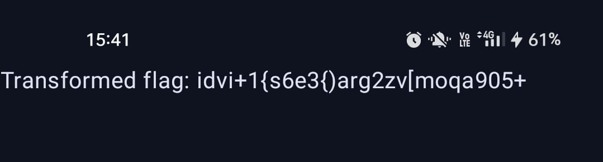

# rev-weird-app

**Category:** Reverse Engineering  
**Attachment:** [/assets/weird.zip](../assets/weird.zip)

---

## Challenge Description
We are given an attachment containing a suspicious file. The goal is to recover the original flag hidden inside the app.

---

## Step 1: Extracting the Attachment
The provided attachment contained a simple `.apk` file.  

**Place this image here:**  



*This image shows the extracted `.apk` file.*

---

## Step 2: Inspecting the APK
Opening the `.apk` file using **Jadx** revealed obfuscated Kotlin code. In the `MainActivity` file, we found the following:

```java
final String transformedFlag = MainActivityKt.transformFlag("REDACTED");
```

The `transformFlag()` function was clearly responsible for encrypting the original flag before displaying it.

---

## Step 3: Encryption Logic
Here is the transformation function inside the app:

```java
public static final String transformFlag(String flag) {
    String res = "";
    for (int i = 0; i < flag.length(); i++) {
        // Letters
        for (int c = 0; c < "abcdefghijklmnopqrstuvwxyz".length(); c++) {
            if ("abcdefghijklmnopqrstuvwxyz".charAt(c) == flag.charAt(i)) {
                int ind = c + i;
                res = res + "abcdefghijklmnopqrstuvwxyz".charAt(ind % 26);
            }
        }
        // Digits
        for (int c2 = 0; c2 < "0123456789".length(); c2++) {
            if ("0123456789".charAt(c2) == flag.charAt(i)) {
                int ind2 = (i * 2) + c2;
                res = res + "0123456789".charAt(ind2 % 10);
            }
        }
        // Symbols
        for (int c3 = 0; c3 < "!@#$%^&*()_+{}[]|".length(); c3++) {
            if ("!@#$%^&*()_+{}[]|".charAt(c3) == flag.charAt(i)) {
                int ind3 = (i * i) + c3;
                res = res + "!@#$%^&*()_+{}[]|".charAt(ind3 % 17);
            }
        }
    }
    return res;
}
```

This function performs the following **encryption**:

- **Letters:** `new_index = (old_index + i) % 26`
- **Digits:** `new_index = (old_index + 2*i) % 10`
- **Symbols:** `new_index = (old_index + i*i) % len(symbols)`

---

## Step 4: Decryption Formulas
To recover the original flag, we reverse the transformation:

- **Letters:** `old_index = (new_index - i) % 26`
- **Digits:** `old_index = (new_index - 2*i) % 10`
- **Symbols:** `old_index = (new_index - i*i + len(symbols)) % len(symbols)`

---

## Step 5: Given Encrypted Flag
From the Android app:  
```
idvi+1{s6e3{)arg2zv[moqa905+
```

---

## Step 6: Manual Decryption
Using the formulas above, we decrypted each character step by step.  
Here is the table of calculations:

| Index (i) | Encrypted Char | Type     | Formula Applied                              | Decrypted Char |
|-----------|---------------|----------|----------------------------------------------|----------------|
| 0         | i             | Letter   | (8 - 0) % 26 = 8 → i                          | i              |
| 1         | d             | Letter   | (3 - 1) % 26 = 2 → c                          | c              |
| 2         | v             | Letter   | (21 - 2) % 26 = 19 → t                        | t              |
| 3         | i             | Letter   | (8 - 3) % 26 = 5 → f                          | f              |
| 4         | +             | Symbol   | (11 - 16 + 17) % 17 = 12 → {                  | {              |
| 5         | 1             | Digit    | (1 - 10) % 10 = 1                             | 1              |
| 6         | {             | Symbol   | (12 - 36 + 17) % 17 = 10 → _                  | _              |
| 7         | s             | Letter   | (18 - 7) % 26 = 11 → l                        | l              |
| 8         | 6             | Digit    | (6 - 16) % 10 = 0                             | 0              |
| 9         | e             | Letter   | (4 - 9) % 26 = 21 → v                         | v              |
| 10        | 3             | Digit    | (3 - 20) % 10 = 3                             | 3              |
| 11        | {             | Symbol   | (12 - 121 + 17) % 17 = 10 → _                 | _              |
| 12        | )             | Symbol   | (9 - 144 + 17) % 17 = 1 → @                   | @              |
| 13        | a             | Letter   | (0 - 13) % 26 = 13 → n                        | n              |
| 14        | r             | Letter   | (17 - 14) % 26 = 3 → d                        | d              |
| 15        | g             | Letter   | (6 - 15) % 26 = 17 → r                        | r              |
| 16        | 2             | Digit    | (2 - 32) % 10 = 0                             | 0              |
| 17        | z             | Letter   | (25 - 17) % 26 = 8 → i                        | i              |
| 18        | v             | Letter   | (21 - 18) % 26 = 3 → d                        | d              |
| 19        | [             | Symbol   | (14 - 361 + 17) % 17 = 10 → _                 | _              |
| 20        | m             | Letter   | (12 - 20) % 26 = 18 → s                        | s              |
| 21        | o             | Letter   | (14 - 21) % 26 = 19 → t                        | t              |
| 22        | q             | Letter   | (16 - 22) % 26 = 20 → u                        | u              |
| 23        | a             | Letter   | (0 - 23) % 26 = 3 → d                          | d              |
| 24        | 9             | Digit    | (9 - 48) % 10 = 1                              | 1              |
| 25        | 0             | Digit    | (0 - 50) % 10 = 0                              | 0              |
| 26        | 5             | Digit    | (5 - 52) % 10 = 3                              | 3              |
| 27        | +             | Symbol   | (11 - 729 + 17) % 17 = 13 → }                  | }              |

---

## Step 7: Recovered Flag
Combining all decrypted characters:
```
ictf{1_l0v3_@ndr0id_stud103}
```

---

## Final Flag
```
ictf{1_l0v3_@ndr0id_stud103}
```

---

